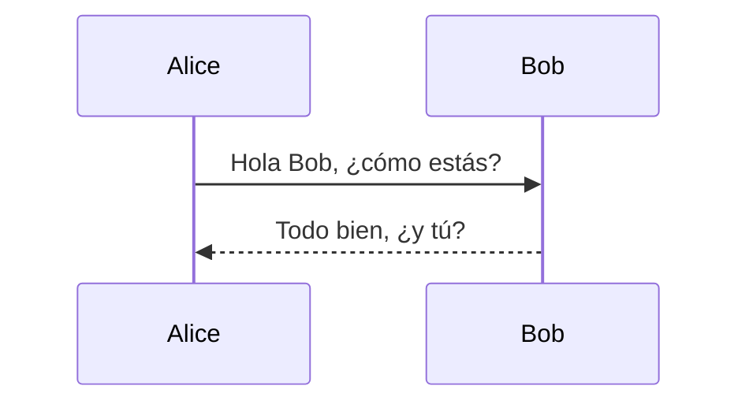

# Links
- [GitHub Repository](https://github.com/Vayioleta/MermaidViewer)
- [Demo en línea](https://vayioleta.github.io/MermaidViewer/)

---

# 🌊 MermaidViewer

Un **visor y editor de diagramas Mermaid** directamente en tu navegador.  
Escribe tus diagramas en sintaxis [Mermaid.js](https://mermaid.js.org/) y visualízalos en tiempo real.

🔗 **Demo en línea**: [MermaidViewer en GitHub Pages](https://vayioleta.github.io/MermaidViewer/)  
❤️ **Apóyame en Patreon**: [patreon.com/vayioleta](https://www.patreon.com/vayioleta)

---

## ✨ Características
- 📂 **Explorador de archivos** estilo VSCode para organizar tus `.mmd`  
- 📝 **Editor integrado** con resaltado de sintaxis  
- ⚡ **Vista previa en vivo** de diagramas Mermaid  
- 🎨 Soporte para múltiples tipos de diagramas:
  - Diagramas de flujo
  - Diagramas de secuencia
  - Gantt
  - Clases
  - ERD
  - Journey
  - Pie Charts
- 💾 Guarda y carga tus archivos `.mmd` fácilmente  
- 🌙 Interfaz moderna y oscura  

---

## 🖼️ Captura de pantalla

---

## 🚀 Uso
1. Abre la [demo online](https://vayioleta.github.io/MermaidViewer/)  
2. Crea un nuevo archivo `.mmd` o abre uno de los ejemplos  
3. Escribe tu código Mermaid y observa cómo se renderiza al instante  

Ejemplo rápido:

---

## 📌 Soporte

Si este proyecto te resulta útil, considera apoyarme en **Patreon**:
👉 [https://www.patreon.com/vayioleta](https://www.patreon.com/vayioleta)

---

## 📜 Licencia

GNU © 2025 [Vayioleta](https://github.com/vayioleta)

